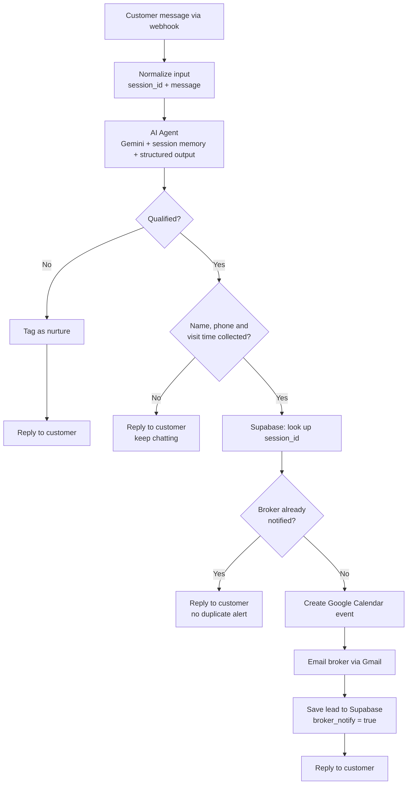
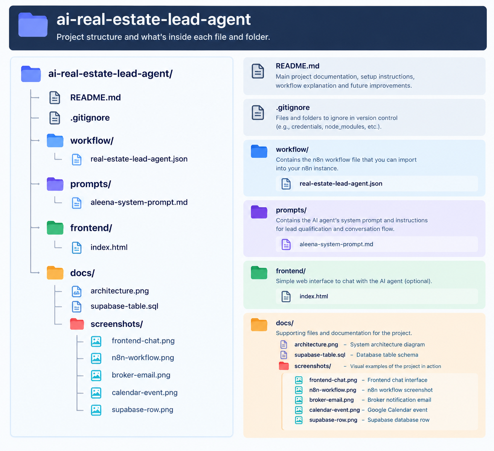

This project is an **AI-powered real estate lead qualification and
property consultation system** designed to automate the initial stage of
the property sales journey.

Instead of requiring a broker or sales representative to manually handle
every incoming inquiry, the AI assistant acts as the **first point of
contact**, engaging leads through a conversational interface and
intelligently gathering their property requirements. It guides the
conversation through key qualification criteria such as **preferred
location, budget, purchase timeline, and purpose**, while maintaining
the context of the conversation through session-based memory.

As the conversation progresses, the system evaluates the lead based on
predefined qualification rules. Qualified leads are guided through the
next stage of the process, where the assistant collects the necessary
contact details and offers to arrange a property consultation. Once a
visit is agreed upon, the system automatically creates a **Google
Calendar appointment** and notifies the broker via **email with the
lead's complete requirements and appointment details**.

Lead information is also stored in **Supabase**, providing a persistent
record of qualified prospects and their captured requirements. Leads
that do not currently meet the qualification criteria are handled
through a separate **nurture path**, allowing the broker to retain their
information without unnecessarily triggering the booking and
notification workflow.

The entire process is orchestrated using **n8n**, with **Google Gemini**
powering the conversational AI, **Supabase** handling lead data,
**Google Calendar** managing consultations, and **Gmail** handling
broker notifications.

The result is an automated lead-handling pipeline that moves a prospect
from **initial inquiry → requirement discovery → lead qualification →
contact collection → consultation scheduling → broker notification**,
reducing repetitive manual work while ensuring that qualified
opportunities are routed efficiently to the sales team.

# **Problem It Solves**

Real estate brokers often spend significant time handling repetitive
inquiries and manually qualifying leads before identifying serious
prospects.

Common challenges include:

- Spending time on leads that are not ready to proceed

- Repeating the same qualification questions

- Manually collecting lead information

- Coordinating site visits through back-and-forth communication

This project automates the initial lead qualification and consultation
process, allowing brokers to focus more on qualified prospects while
reducing repetitive manual work.

# Solution Overview

Aleena, an AI-powered real estate assistant, automates the initial
lead-handling process from first conversation to broker handoff. The
workflow uses n8n to coordinate AI qualification, data collection,
scheduling, notifications, and lead storage.

**AI-powered lead qualification** — Converses naturally with leads in
English, Roman Urdu, or a mix while collecting location, budget,
timeline, and purpose.

**Automated data collection** — Captures the lead’s name, phone number,
preferred area, expected budget, timeline (if any) without requiring
manual forms.

**Intelligent qualification** — Evaluates the collected requirements and
identifies leads that meet the defined qualification criteria.

**Automated scheduling** — For qualified leads ready for a consultation,
coordinates a site visit and creates the corresponding Google Calendar
event.

**Instant broker notification** — Sends the broker a structured summary
of the qualified lead and scheduled visit via email.

**Centralized lead storage** — Stores qualified lead information in
Supabase for tracking and follow-up.

The result is an automated lead qualification and consultation pipeline
that reduces repetitive manual work and allows brokers to focus on leads
that are ready for the next step.

# How It Works

## Step by step

1.  **Webhook receives the message.** The customer chats through the web
    page (or, later, WhatsApp), and each message arrives with its
    session_id as a POST request.

2.  **AI Agent responds.** Gemini answers using a system prompt with
    strict rules, and returns a structured JSON output (reply, lead
    status, name, phone, email, budget, timeline, visit time and more).
    Memory is keyed on session_id, so each customer has their own
    conversation.

3.  **Qualification check.** A lead is qualified only when it has a
    **concrete budget** and a timeline of **3 months or less**. Everyone
    else is tagged nurture and keeps chatting with the agent.

4.  **Duplicate check.** The workflow looks up the session_id in
    Supabase. If a row with broker_notify = true exists, the broker was
    already notified, so nothing more is sent.

5.  **Notify.** A Google Calendar event is created for the visit, the
    broker receives an email with all lead details and the calendar
    link, and the lead is saved in Supabase.

6.  **Reply.** The agent's reply is returned to the customer through the
    webhook response, so the conversation continues naturally.

## Agent behaviour highlights

- Asks **one question at a time**, in a fixed order: location → property
  type → purpose→ budget → timeline →necessary personal details→ visit
  time .

- Only starts collecting contact details after the full requirement is
  known.

- State-aware interaction — Remembers previously provided information,
  extracts new details from each message, and never asks for information
  that is already known.

- Asks for email **once**, as an optional step, and never again if
  declined.

- Never invents prices, availability, legal or RERA information. It
  passes those questions to the human team.

- Converts visit times like "tomorrow at 9 PM" into ISO 8601 timestamps
  in Pakistan time.

- Ignores prompt-injection attempts and treats instructions embedded in
  customer messages as ordinary text and never reveals system
  instructions, internal rules, or schemas.

- Context-aware conversation handling — Recognizes greetings, small
  talk, off-topic messages, and abusive input, responds appropriately,
  and redirects the conversation toward the property requirement when
  necessary.

## Demo Frontend

Since the Meta WhatsApp integration is not connected yet, I built a
simple chat web page that lets a customer talk to the agent. It acts as
the customer-facing side of the system.

- The customer types a message in a chat interface.

- The page creates a **unique session_id** for each visitor, so every
  customer gets their own conversation memory.

- Each message is sent to the n8n webhook as a POST request containing
  the session_id and the message.

- The page displays the agent's reply from the webhook response, so it
  feels like a normal chat.

- Everything else (qualification, calendar event, broker email,
  database) runs inside the n8n workflow, so the same logic will work
  once WhatsApp is connected.

- The page is built with \[HTML, CSS and JavaScript\].

  

# Tech Stack

| **Tool**                     | **Purpose**                                                                         |
|------------------------------|-------------------------------------------------------------------------------------|
| **Web page (chat frontend)** | Chat interface for customers, used to demonstrate the workflow in place of WhatsApp |
| **n8n**                      | Workflow automation and orchestration                                               |
| **Google Gemini**            | Language model behind the agent                                                     |
| **n8n Simple Memory**        | Per-session conversation memory                                                     |
| **Supabase (Postgres)**      | Stores leads and tracks whether the broker was notified                             |
| **Gmail**                    | Sends the qualified-lead email to the broker                                        |
| **Google Calendar**          | Creates the site-visit event                                                        |
| **Webhook**                  | Entry point for chat messages (for example from WhatsApp or any web-page)           |

# Key Challenges I Solved

## 1. Duplicate broker emails and calendar events

**Problem:** After a lead qualified, the customer kept chatting ("okay",
"thank you", "bye"). Every message triggered the qualified branch again,
so the broker received extra emails and calendar events.

**Cause:** The workflow created a new database row on every message,
with broker_notify = false, and then checked that fresh row, so the
check always passed.

**Fix:** The workflow now **looks up the session first** and only writes
the row **after** the notification is sent, with broker_notify = true.
Later messages find that row and skip the notification. If the email or
calendar step fails, no row is saved, so the next message retries.

## 2. Notifying the broker too early

**Problem:** The agent marks a lead as qualified as soon as budget and
timeline are known, which is before it has collected a name, phone
number or visit time. That produced incomplete alerts and calendar
errors.

**Fix:** A Details Complete? check holds the notification until name,
phone and a visit time are all present.

## 3. Wrong calendar times

**Problem:** The agent outputs Pakistan local time without an offset, so
events were created at the wrong hour.

**Fix:** The prompt requires 24-hour ISO 8601 output, and the Calendar
node parses the time explicitly in the Asia/Karachi zone, supports
start/end ranges, and defaults to a 1-hour event.

## 4. Reliable, structured agent output

The agent returns a fixed JSON schema through a Structured Output
Parser, which lets the workflow make decisions (qualified or not, ready
to notify or not) from clear fields instead of parsing free text.

# Setup

## Prerequisites

- An n8n instance (cloud or self-hosted)

- A Google AI (Gemini) API key

- A Supabase project

- A Google account for Gmail and Google Calendar

## 1. Create the Supabase table

Run this in the Supabase SQL Editor:

> create table "Lead_Gen" (
>
> id bigint generated always as identity primary key,
>
> created_at timestamptz default now(),
>
> session_id text not null unique,
>
> name text,
>
> phone text,
>
> email text,
>
> property_type text,
>
> preferred_location text,
>
> budget text,
>
> timeline text,
>
> visit_schedule text,
>
> broker_notify boolean default false
>
> );

The unique constraint on session_id prevents duplicate leads if two
messages arrive at nearly the same time.

## 2. Import the workflow

1.  In n8n, go to **Workflows → Import from file**.

2.  Select workflow/real-estate-lead-agent.json.

## 3. Add credentials

Create and attach these credentials in n8n:

| **Node**                              | **Credential**                                  |
|---------------------------------------|-------------------------------------------------|
| Google Gemini Chat Model              | Google Gemini (PaLM) API key                    |
| Get Existing Lead, Create a row       | Supabase API (project URL and service role key) |
| Gmail - Notify Broker                 | Gmail OAuth2                                    |
| Google Calendar - Create Consultation | Google Calendar OAuth2                          |

## 4. Update the placeholders

- **Gmail node:** set Send To to the broker's email address.

- **Calendar node:** choose your own calendar.

- **Workflow Settings:** set **Timezone** to Asia/Karachi (or your own
  timezone, and update the timezone in the prompt and Calendar
  expressions to match).

## 5. Activate and test

Activate the workflow, then send a test message to the production
webhook URL:

> curl -X POST https://YOUR-N8N-URL/webhook/lahore-property-agent \\
>
> -H "Content-Type: application/json" \\
>
> -d '{"session_id": "test-001", "message": "Hi, I am looking for house
> in DHA Lahore"}'

Response:

> {
>
> "success": true,
>
> "reply": "Great choice! What budget range are you considering?",
>
> "lead_status": "not_qualified"
>
> }

Keep using the same session_id to continue the conversation. To connect
WhatsApp, point your WhatsApp integration (for example the WhatsApp
Business API, Twilio or a similar provider) at this webhook and pass the
customer's number as the session_id.

## 6. Run the demo frontend

1.  Open the frontend file and set the webhook URL at the top of the
    script:

> const WEBHOOK_URL =
> "https://YOUR-N8N-URL/webhook/lahore-property-agent";

2.  Open the file in a browser.

3.  Start chatting. Each browser session gets its own session_id.

## 7. Test the full flow

Use a new session_id, give a budget and a timeline within 3 months, then
provide a name, phone number and a visit time. You should get **one**
broker email, **one** calendar event and **one** Supabase row. Any
further messages in the same session should not trigger anything new.

# Screenshots

## n8n Workflow:

**Broker’s Email:**

## Google Calender:

## Supabase:

# Project Structure

# Current Limitations

- **No WhatsApp (Meta) integration yet.** The workflow is designed for
  WhatsApp conversations, but I haven't connected the Meta WhatsApp
  Business API, so the chat is not live on WhatsApp. To demonstrate the
  automation, I use the webhook with a simple web page as the chat
  frontend. The workflow logic is the same, and connecting WhatsApp only
  requires pointing the WhatsApp provider's incoming messages at the
  webhook and sending the reply back through it.

- The lead record is saved **once**, at notification time. If the
  customer changes their visit time or contact details later, the record
  and calendar event are not updated.

- Conversation memory uses n8n's in-workflow buffer, which resets if n8n
  restarts.

- Leads that are not yet qualified are tagged in the workflow but not
  stored in the database.

# Future Improvements

- **Update the record after notification:** sync changes to the visit
  time, email or budget to Supabase and the calendar event, and email
  the broker only when something meaningful changes.

- **Error alerts:** add an Error Trigger workflow that notifies the
  owner if Gmail, Calendar or Supabase fails.

- **RAG (Retrieval-Augmented Generation):** Connect the agent to the
  broker's own data, such as property listings, project brochures and
  FAQs, stored as embedding in a vector database.. Today the agent
  deliberately avoids answering questions about specific prices,
  availability or documents and passes them to the human team. With RAG
  it could answer from the broker's verified information and recommend
  matching properties.

- **WhatsApp integration:** Connect the Meta WhatsApp Business API to
  the existing n8n webhook and use the customer’s WhatsApp number as the
  session_id to maintain conversation history and allow leads to
  interact directly through WhatsApp.

- **CRM integration:** push qualified leads into a CRM such as HubSpot
  or Zoho.

- **Persistent memory:** switch to Postgres Chat Memory so conversations
  survive restarts.

- **Store nurture leads:** save unqualified leads so they can be
  followed up later.

- **Broker dashboard:** a simple view of leads, status and upcoming
  visits.

# Author

**Hamna Khalid**

Linkedin:

https://www.linkedin.com/in/hamnak/

Gmail:

hamnakhalid399@gmail.com
